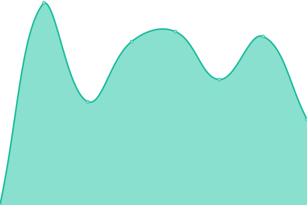

# [📈 Live Status](https://upptime.github.io/upptime): <!--live status--> **🟩 All systems operational**

This repository contains the open-source uptime monitor and status page for [Upptime](https://upptime.js.org), powered by [Upptime](https://github.com/upptime/upptime).

With [Upptime](https://upptime.js.org), you can get your own unlimited and free uptime monitor and status page, powered entirely by a GitHub repository. We use [Issues](https://github.com/upptime/upptime/issues) as incident reports, [Actions](https://github.com/talanta-by-tig/brussels/actions) as uptime monitors, and [Pages](https://upptime.github.io/upptime) for the status page.

<!--start: status pages-->
<!-- This summary is generated by Upptime (https://github.com/upptime/upptime) -->
<!-- Do not edit this manually, your changes will be overwritten -->
<!-- prettier-ignore -->
| URL | Status | History | Response Time | Uptime |
| --- | ------ | ------- | ------------- | ------ |
|  [Sydney](https://sydney.talanta.com/api/health) | 🟩 Up | [sydney.yml](https://github.com/talanta-by-tig/brussels/commits/HEAD/history/sydney.yml) | 

 537ms
     
 | 

<a href="https://status.talanta.com/history/sydney">100.00%</a>
    

|  [London](https://api.talanta.com/api/health) | 🟩 Up | [london.yml](https://github.com/talanta-by-tig/brussels/commits/HEAD/history/london.yml) | 

 529ms
     
 | 

<a href="https://status.talanta.com/history/london">100.00%</a>
    

|  [Medellin](https://platform.talanta.com/login) | 🟩 Up | [medellin.yml](https://github.com/talanta-by-tig/brussels/commits/HEAD/history/medellin.yml) | 

 566ms
     
 | 

<a href="https://status.talanta.com/history/medellin">100.00%</a>
    

|  [Buenos Aires](https://placement.talanta.com/login) | 🟩 Up | [buenos-aires.yml](https://github.com/talanta-by-tig/brussels/commits/HEAD/history/buenos-aires.yml) | 

 441ms
     
 | 

<a href="https://status.talanta.com/history/buenos-aires">100.00%</a>
    

|  [Tokyo](https://hosts.talanta.com/login) | 🟩 Up | [tokyo.yml](https://github.com/talanta-by-tig/brussels/commits/HEAD/history/tokyo.yml) | 

 453ms
     
 | 

<a href="https://status.talanta.com/history/tokyo">100.00%</a>
    

|  [Caracas](https://apply.talanta.com/gap/introduction) | 🟩 Up | [caracas.yml](https://github.com/talanta-by-tig/brussels/commits/HEAD/history/caracas.yml) | 

 328ms
     
 | 

<a href="https://status.talanta.com/history/caracas">100.00%</a>
    

<!--end: status pages-->

[**Visit our status website →**](https://upptime.github.io/upptime)

## 📄 License

- Powered by: [Upptime](https://github.com/upptime/upptime)
- Code: [MIT](./LICENSE) © [Upptime](https://upptime.js.org)
- Data in the `./history` directory: [Open Database License](https://opendatacommons.org/licenses/odbl/1-0/)
